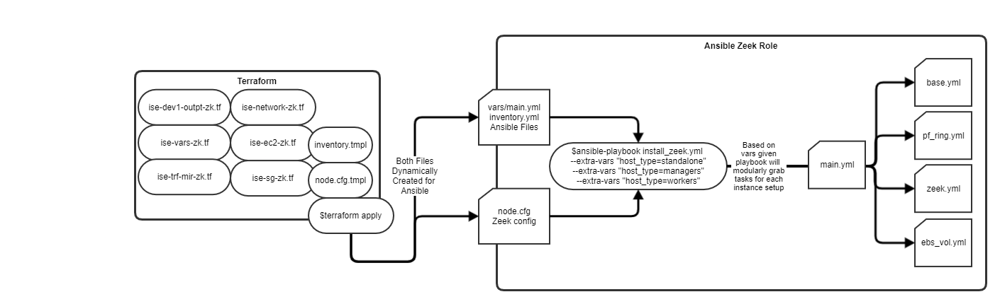

## Prerequisites:

**Control Node**

- Ansible installed on your jump box or administrative box (ver 2.9.6 leveraged here)

- Sudo SSH Key access to sensor instances

- Python3

- Terraform (ver v0.14.3 leveraged here)

- aws-cli/1.18.202 Python/3.8.5 Linux/4.4.0-19041-Microsoft botocore/1.19.42

**Sensor Nodes:**

- Amazon Linux 2 Image 

- User with SSH Key Access and Sudo

- zeek 4.0.0:latest Dec 15 2020
  
## Zeek Sensors Behind NLB 
This is the basic architecture that will be created for the terraform code here. Exists inside it's own VPC. Traffic mirroring sources will be pointed at NLB and will be traffic balanced to each sensor in 3 different AZs. Projected to handle 1.5 - 2 Gbps, potentially even more.


## Zeek Sensors Using PF_RING 
Each sensor is built using the PF_RING kernel module, which allows multiple zeek pids to be pinned on each CPU core. Code changes will be required in the node.tmpl file of terraform if pinning a different CPU architecture (e.g. only 2 cores and so on).


## IaC Pipeline
This build can easily fold into a jenkins job or rapidly deployed and changed with terraform and ansible. Terraform will create all the files necessary for ansible to do it's job. Each ansible playbook is treated as a bucket and can accommodate differing Zeek deployments. 


```bash
export AWS_DEFAULT_REGION=""
# one liner to deploy the zeek infrastructure
terraform apply --auto-approve && cd ../ansible && ansible-playbook -i inventory.yml install_zeek.yml --extra-vars="standalone"
```

### References
https://github.com/zeek/zeek
https://github.com/ntop/PF_RING
https://docs.zeek.org/en/current/cluster-setup.html#pf-ring-config
https://docs.zeek.org/en/current/cluster-setup.html
