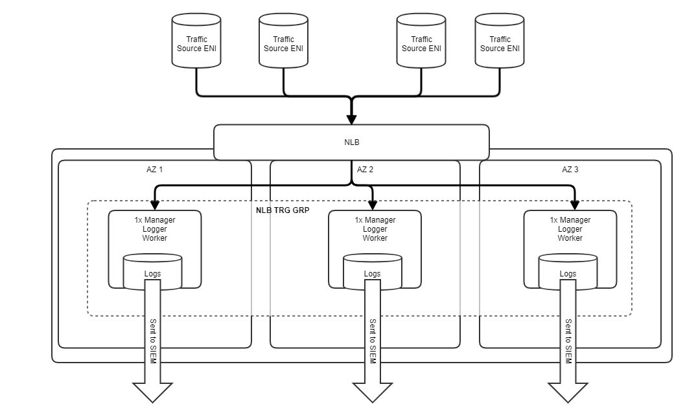
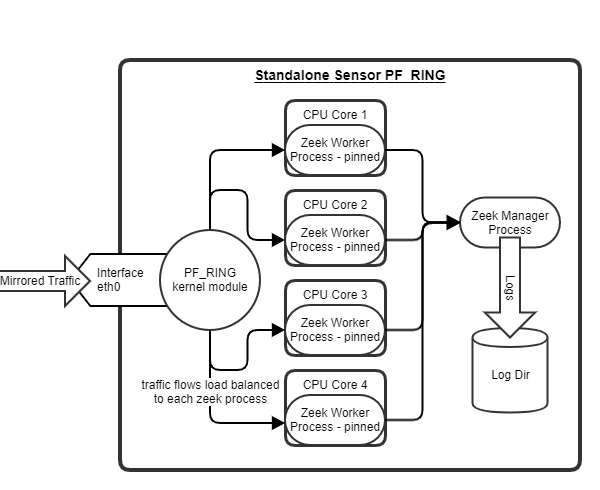

## Prerequisites:

  

**Control Node**

- Ansible installed on your jump box or administrative box (ver 2.9.6 leveraged here)

- Sudo SSH Key access to sensor instances

- Python3

- Terraform (ver v0.14.3 leveraged here)

- aws-cli/1.18.202 Python/3.8.5 Linux/4.4.0-19041-Microsoft botocore/1.19.42

**Sensor Nodes:**

- Amazon Linux 2 Image 

- User with SSH Key Access and Sudo

- zeek 3.0.12: latest Dec 15 2020
  
# Zeek Sensors Behind NLB 

# Zeek Sensors Using PF_RING 

### References

https://github.com/zeek/zeek